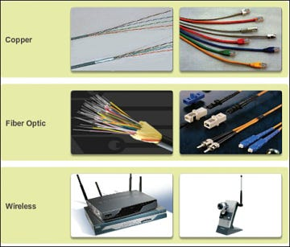

| **Title** | 1.2 Network Components |
|:---------:|:----------------------:|
| **ID**    | CCNET002               |
| **Tag**   | CCNA, Cisco, NetAcad, Network Components |

## 1.2.0 Mục tiêu
- Hiểu vai trò thiết bị trong mạng.
- Phân biệt host, client, server.
- Hiểu mô hình peer-to-peer.
- Biết các thiết bị đầu cuối, thiết bị trung gian và phương tiện truyền dẫn.

---

## 1.2.1 Host Roles

- Thiết bị kết nối mạng & tham gia giao tiếp gọi là **host** (*end device*).
- Mỗi host có **địa chỉ IP** để nhận diện trên mạng.
- **Server**: Cung cấp dịch vụ (web, mail) cho **client**.
- **Client**: Yêu cầu & hiển thị dữ liệu từ **server** (VD: Chrome, Firefox).
- 1 máy tính có thể chạy nhiều phần mềm **client** cùng lúc.

---

## 1.2.2 Peer-to-Peer

- Một máy có thể vừa **client** vừa **server**.
- **Peer-to-peer network**: Các máy tính chia sẻ tài nguyên trực tiếp.
- Thường dùng trong gia đình, doanh nghiệp nhỏ (VD: chia sẻ máy in, file).

---

## 1.2.3 End Devices

- **End devices**: Nguồn gửi hoặc đích nhận dữ liệu.
- Mỗi end device có **địa chỉ riêng**.
- Dùng địa chỉ đích để định hướng gói tin.

---

## 1.2.4 Intermediary Devices

- Kết nối các **end devices**, tạo **internetwork**.
- Quyết định đường đi dữ liệu dựa vào địa chỉ đích & thông tin mạng.
- VD: Switch, router, firewall.

---

## 1.2.5 Network Media

- **Media**: Kênh truyền dữ liệu giữa **source** ↔ **destination**.
- 3 loại phổ biến:
  - **Dây lõi kim loại (Copper - dây đồng)**: Tín hiệu điện.
  - **Dây lõi thủy tinh/ nhựa (Fiber-optic - Cáp quang**: Tín hiệu ánh sáng.
  - **Không dây (Wireless)**: Sóng điện từ.

  

---

> *Theo Cisco NetAcad – Module 1.2*
