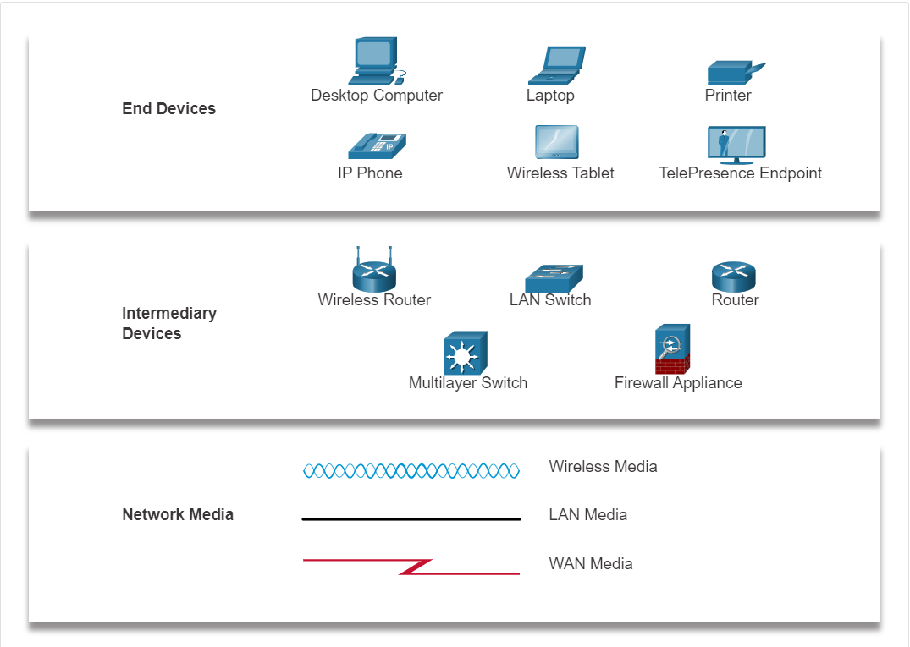
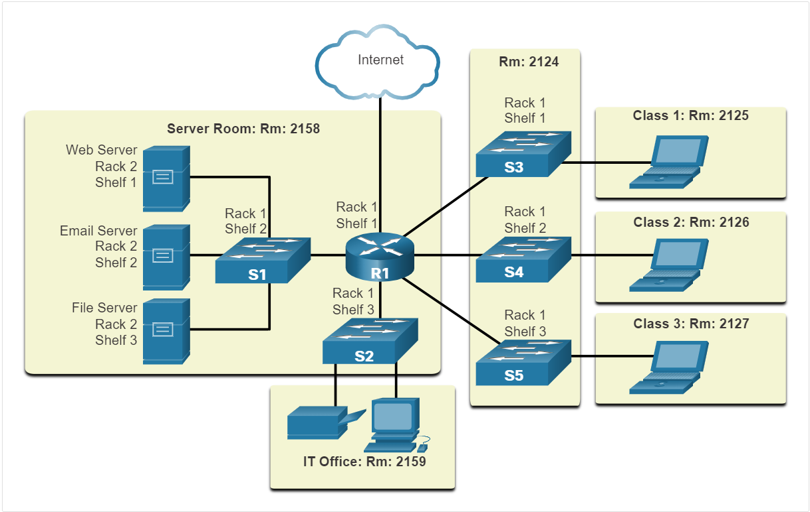
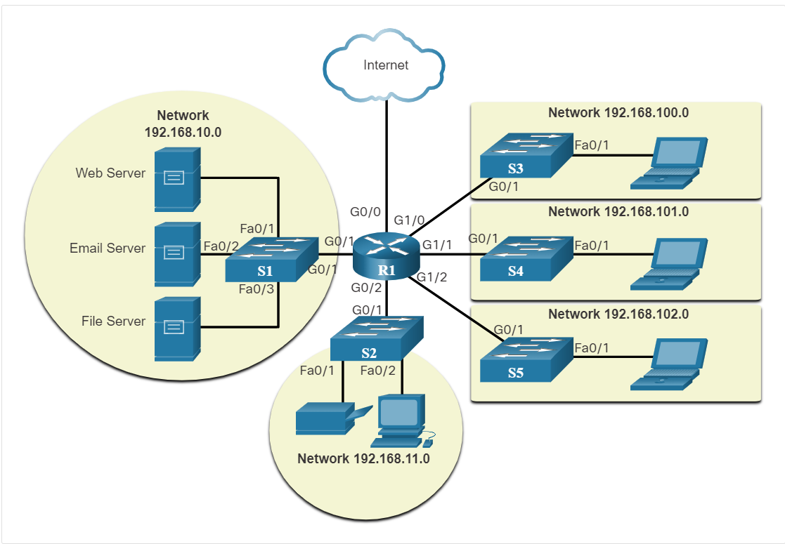

| **Title** | 1.3 Network Representations and Topologies |
|:---------:|:------------------------------------------:|
| **ID**    | CCNET003                                   |
| **Tag**   | CCNA, Cisco, NetAcad, Network Topology     |

---

## 1.3.0 Mục tiêu

- Hiểu **biểu diễn mạng** bằng sơ đồ.
- Biết **ký hiệu**, thiết bị, cổng kết nối.
- Phân biệt **Physical & logical topology**.

---

## 1.3.1 Network Representations

- **Kiến trúc mạng** cần sơ đồ để dễ hình dung.
- **Topology diagram**: Hình vẽ mô tả thiết bị & kết nối.
- Biết nhận diện **thành phần vật lý & logic**.

  

- Một số thuật ngữ:
  - **NIC**: Kết nối thiết bị đầu cuối với mạng.
  - **Physical Port**: Cổng kết nối cáp.
  - **Interface**: Cổng mạng chuyên dụng (trên router).

*Note: Port & Interface có thể dùng thay thế nhau.*

---

## 1.3.2 Topology Diagrams

- **Topology diagram** là tài liệu bắt buộc.
- Giúp hiểu **ai kết nối với ai**, dùng **cáp gì**, địa chỉ nào.
- 2 loại:
  - **Physical topology**: Trình bày vị trí vật lý của thiết bị, dây cáp.

  

  - **Logical topology**: Trình bày địa chỉ của thiết bị, cổng...

  

---

> *Theo Cisco NetAcad – Module 1.3*
